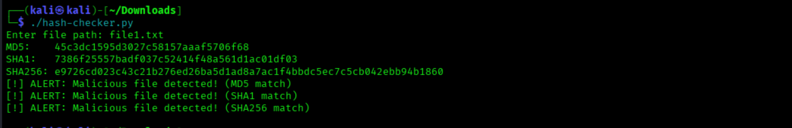
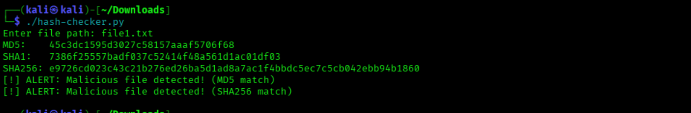
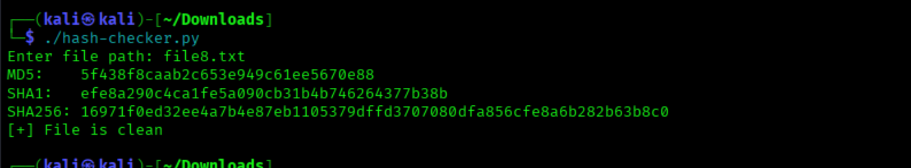

# Malicious Hash Detector

## 📖Overview
This project simulates a **basic malware detection system** using file integrity verification.  
It checks file hashes (MD5, SHA1, SHA256) against a list of **known malicious hashes**.

## ✨Features
- Supports **MD5, SHA1, and SHA256** hashing
- Compares file hash against a malicious hash database
- Alerts if file is malicious, otherwise reports safe

## 📂Project Files
- `bad-hashes.txt` → Contains hashes of malicious files
- `malicious-files/` → Contains 6 sample malicious text files
- `safe-files/` → Contains 2 safe text files
- `hash-checker.py` → Main script to check file hashes

## 📝Creating some files
  ### 1. Malicious Files
  ```bash
    echo "Cybersecurity" > file1.txt && echo "is not" > file2.txt && echo "just my" > file3.txt && echo "skill," > file4.txt && echo "it is" >     file5.txt && echo "my passion" > file6.txt
  ```

- [malicious-files](./malicious-files/) → Contains 6 sample malicious text files

### 2. Safe files
```bash
echo "Hey" > file7.txt && echo "I'm Good" > file8.txt
 ```

- [safe-files](./safe-files/) → Contains 2 sample text files

## 🔑Generating Hashes
### 1. MD5,SHA1,SHA256
```bash
md5sum *.txt
```
```bash
sha1sum *.txt
```
```bash
sha256sum *.txt 
```
- [bad-hashes.txt](./bad-hashes.txt) → Contains known malicious hashes

### 2. Creating bad-hashes.txt file


## 🐍Python Scripting
### 1. Creating hash-checker.py
 ```bash
#!/usr/bin/env python3
import hashlib

# Load known bad hashes
bad_hashes = open("bad-hashes.txt").read().splitlines()

file = input("Enter file path: ")

# Read file in binary
with open(file, "rb") as f:
    data = f.read()

# Generate hashes
md5 = hashlib.md5(data).hexdigest()
sha1 = hashlib.sha1(data).hexdigest()
sha256 = hashlib.sha256(data).hexdigest()

print(f"MD5:    {md5}")
print(f"SHA1:   {sha1}")
print(f"SHA256: {sha256}")

# Check against bad list and show which hash matched
if md5 in bad_hashes:
    print("[!] ALERT: Malicious file detected! (MD5 match)")
if sha1 in bad_hashes:
    print("[!] ALERT: Malicious file detected! (SHA1 match)")
if sha256 in bad_hashes:
    print("[!] ALERT: Malicious file detected! (SHA256 match)")
else:
    print("[+] File is clean")
   ```
- [hash-checker.py](./hash-checker.py) → Contains python script

### 2. Executing permission
 ```bash
chmod -x hah-checker.py
 ```

### 3. Run
 ```bash
./hash-checker.py
 ```
## 🛡️Checking Integrity
### 1. Checking file1.txt
 ```bash
Enter file path: file1.txt
 ```


### 2. Again Checking file1.txt (Removed SHA1 from bad-hashes.txt)
  ```bash
Enter file path: file1.txt
  ```


### 3. Checking Good File
  ```bash
Enter file path: file8.txt
  ```

I didn't added file8.txt hash to bad-hashes.txt file. that's why this file is good

